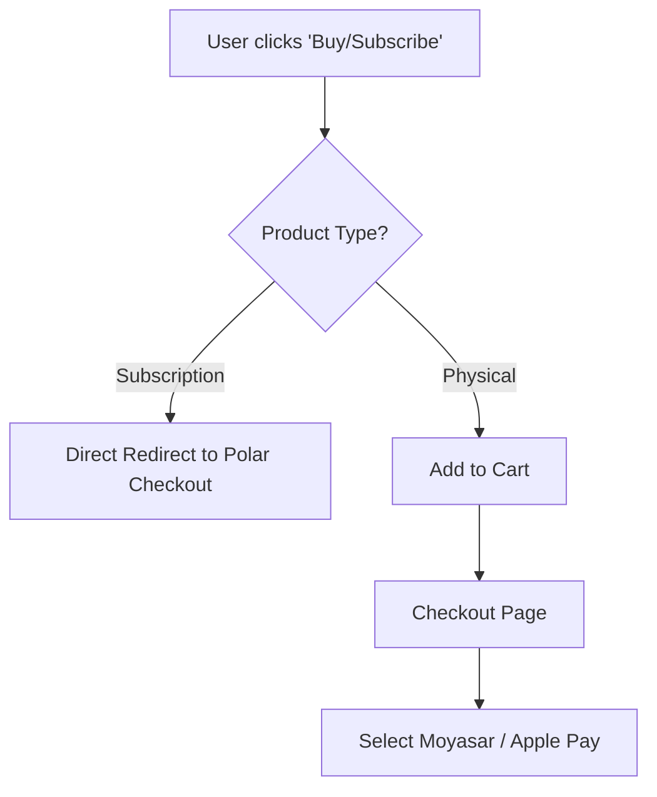

# Payment System Architecture & Ideas

This document outlines the proposed technical architecture and strategies for integrating multiple payment gateways (**Moyasar** and **Polar**) while maintaining a clean, scalable, and professional codebase "prepared for something BIG".

---

## 1. Unified Configuration System

Instead of hardcoding gateway logic in components and routes, we move to a **Provider Configuration** model.

### Centralized Config

Create a configuration file (e.g., `packages/shared/config/payments.ts`) that defines:

- **Provider Registry**: Metadata about each provider (Name, Capabilities, Icon, Supported Countries).
- **Status Mapping**: A unified status map (e.g., `MOYASAR_PAID` -> `TRANSACTION_SUCCESS`).
- **Feature Toggles**: Ability to enable/disable providers based on product type or merchant preference.

```typescript
export const PAYMENT_PROVIDERS = {
  moyasar: {
    id: "moyasar",
    name: "Moyasar",
    capabilities: ["one-time"],
    countries: ["SA", "AE", "KW"],
    requiresShipping: true,
  },
  polar: {
    id: "polar",
    name: "Polar",
    capabilities: ["subscription", "digital"],
    countries: "global",
    requiresShipping: false,
  },
};
```

---

## 2. Smart Checkout Workflows

To avoid complexity, we implement **Dynamic Checkout Routing** (The "Checkout Guard").

### The "Skip the Cart" Flow

- **Subscriptions**: If a product is a "Subscription", the "Add to Cart" button is replaced with "Subscribe Now".
- **Validation (Checkout Guard)**:
  - If a user tries to add a subscription to a non-empty cart, we show a smart modal: _"Subscriptions must be purchased separately. Clear cart and continue?"_.
  - This keeps the database logic clean and avoids "Mixed Cart" errors (Physical vs Subscription).



---

## 3. Merchant Experience (Admin Dashboard)

The dashboard should empower the merchant without requiring technical knowledge.

### Safe Activation & Sync

- **Environment Validation**: Before enabling Polar, the UI checks if `POLAR_API_KEY` is present. If not, it guides the merchant to the settings page.
- **Bulk Sync with Trigger.dev**:
  - If Polar is enabled _after_ products exist, a "Sync with Polar" button appears.
  - Clicking it triggers a background job (`trigger.dev`) that creates all products in Polar and saves their IDs in our DB.
  - **Notification**: Use a toast or an "Admin Notification" to inform the merchant: _"Sync completed: 24 products added to Polar."_

---

## 4. Product Synchronization Strategy

Polar acts as the "Source of Truth" for subscription checkout links.

1. **Automatic Sync**: Use a database trigger or a Next.js Action that starts a `trigger.dev` task whenever a product is updated.
2. **Mapping Table**: Store `provider_product_id` in a separate table (`ProductIntegrations`) to avoid cluttering the main `Product` schema.

---

## 5. Code Refactoring & "No-Hardcode" Policy

To make the codebase professional:

### Standardized Payment States

- Define a global enum for payment states: `PENDING`, `COMPLETED`, `FAILED`, `REFUNDED`.
- Each provider (Moyasar, Polar) has a "Mapper" function that converts their specific raw status to ours.

### Separate Payment Details

- **Test Data**: Store cards (e.g., `4242...`), phone numbers, and demo credentials in a dedicated `config/constants/payment-demo.ts`. Use these for "Sandbox Mode" UI hints.
- **Provider Interface**:

```typescript
interface PaymentProvider {
  createCheckout(data: CheckoutData): Promise<string>;
  verify(id: string): Promise<VerificationResult>;
  webhookHandler(payload: any): Promise<void>;
}
```

---

## 6. UI/UX: The "WOW" Factor

- **Smart Payment Sheets**: Detect card type (Mada vs Visa) visually as the user types.
- **Localized Payments**: Show Apple Pay as the primary button for users in Saudi Arabia (Moyasar).
- **Error Intelligence**: Instead of "Something went wrong", show "Your card was declined by the bank. Please try another card."

---

## 7. Future Scalability

- **Plugin Architecture**: The system is designed so that adding "Stripe" or "PayPal" is just a matter of adding a new file in a `providers/` directory that satisfies the `PaymentProvider` interface.
- **Subscription Tracking**: A dedicated `Subscription` table tracks lifecycle events (renewal, cancellation) independently of orders.

> [!IMPORTANT]
> By separating **Policy** (how we handle subscriptions) from **Mechanism** (Polar vs Moyasar), we ensure the project remains maintainable even as it grows to handle thousands of orders.
